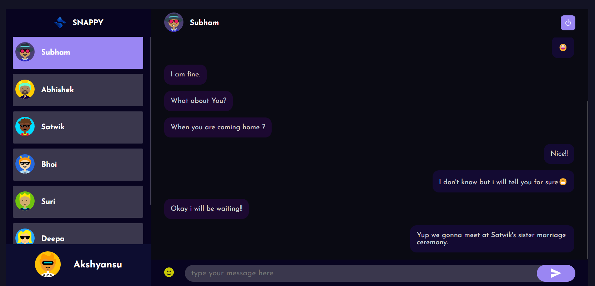

# Snappy - Chat Application 
Snappy is chat application build with the power of MERN Stack.




## Installation Guide

### Requirements
- [Nodejs](https://nodejs.org/en/download)
- [Mongodb](https://www.mongodb.com/docs/manual/administration/install-community/)

Both should be installed and make sure mongodb is running.
### Installation

#### First Method
```shell
git clone https://github.com/Akshyansu3479/chat_app_public
cd chat_app_public
```


Now install the dependencies
```shell
cd server
yarn
cd ..
cd public
yarn
```
Now just start the development server.

For Frontend.
```shell
cd public
yarn start
```
For Backend.

Open another terminal in folder, Also make sure mongodb is running in background.
```shell
cd server
yarn start
```
Done! Now open localhost:3000 in your browser.

